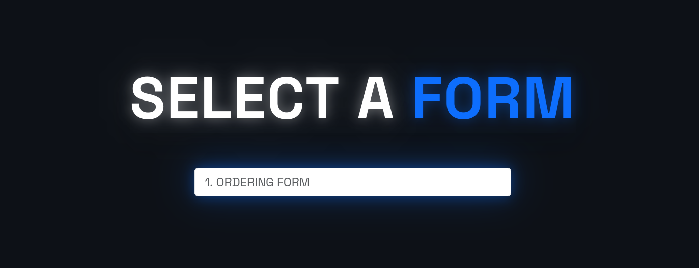

# Tally Automation

## PRE REQUISITES:
1. Tally.so API key
2. This specific tally form **[template](https://tally.so/templates/ordering-form-universal/wLNKvm)**
3. CSV file with the same structure as shown in [example.csv](example.csv)

## OVERVIEW:
This is an automation script I made for a specific product ordering form for businesses operating without a website, or for businesses that want simplicity. It uses tally.so api to automate block creation. The problem i was trying to solve is that when i made the simple tally form, I found out that to add just a single product I would have to go through so many steps such as creating a dropdown menu, adding price, adding all data to the table and most importantly the huge conditional logic block. Most of the steps were highly redundant. Therefore, I thought of making a script that would simply take the useful data in csv format and create all the conditional logic and product adding along with the correct "grouped structue" of blocks automatically. It is a pretty specific product but it is great in what it does.

## HOW TO RUN:

### 1. Go to the live demo at https://tally-auto.vercel.app
### 2. Enter your tally.so API key (the api key is stored only in session storage)

### 3. Select your form (please use the **[template](https://tally.so/templates/ordering-form-universal/wLNKvm)** as this is the only form supported)

### 4. Upload your CSV file (make sure the structure matches with [example.csv](example.csv)) 

## FUTURE IMPLEMENTATIONS:
1. Login system
2. Databse implementation 
3. Some kind of template validation
4. Product deletion support
5. Update history and rollbacks
6. Dashboard
7. Wider forms support (probably)

## LOCAL SETUP:
1. Clone the repository
2. Create a virtual environment and activate it
3. Run `pip install -r requirements.txt`
4. Run `python main.py`
5. Open `http://127.0.0.1:5000` in your browser

## LIVE DEMO:

https://tally-auto.vercel.app

(made by: r10m-10)